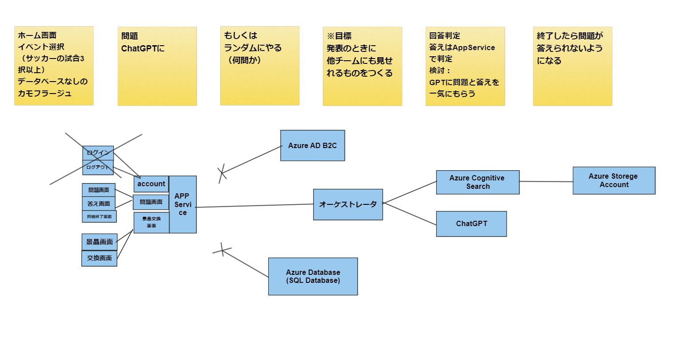

# 要件定義

## サービス名
### InterActLive
（インターアクトライブ）

## 前提課題
スポーツ観戦や音楽ライブについての課題

今回の例では、サッカーを主軸に説明する。

## 概要
スポーツ観戦や音楽ライブの待ち時間や休憩時間で、会場全体（ライブ配信視聴でも可）で楽しめるミニゲームイベント

ゲームに勝利し、ポイントを獲得を目指す。

- 待ち時間や休憩時間に陥ること
  - 興奮が落ち着き、我に返る
  - 休憩時間でも興奮を続けたい
  - とりあえずSNSでみんなの様子を確認する

### ポイントと引き換えに以下の報酬が受け取れる。（案）
- 選手とのビデオ通話の権利: 参加者がお気に入りの選手と個人的に交流できる貴重な機会。
- サイン入りの公式ユニフォーム: チームの現役選手全員からのサインが入った特別なユニフォーム。
- オフィシャルクラブグッズ: チームのマフラーやキャップ、ステッカー、バッジなどのグッズ
- クラブの歴史本: チームの歴史や成功を紹介した本やDVD。
- スタジアムツアーチケット: スタジアムの内部を案内してもらえるツアーのチケット。
- スタジアム内の飲食物一割引券: ゲームデーにスタジアムで利用できる飲食物の割引券。
- スタジアムのフードコートでの無料食事: スタジアムのフードコートで使用可能な無料食事クーポン。
- スタジアムのvip席での観戦体験: 最高のロケーションにある席で試合を観戦する権利。

### ターゲット
観客

## 解決したい課題
- ライブやスポーツ観戦の待ち時間（休憩時間 等）が暇になることが多い（リアル・オンライン）
- リアルイベントの雰囲気が好きで、テンションを上げたままでいたい（リアル）

## 解決策
全観客参加型ミニゲームイベント

### 概要
スポーツ観戦や音楽ライブの待ち時間や休憩時間で、会場全体（ライブ配信視聴者でも可）で楽しめるミニゲームイベント

### 解決プロセス
1. 選手の休憩時間に突入後、ミニゲームイベント開催
2. 参加したい人は携帯を開き、ゲームに参加
3. ゲームの勝利に応じて、ポイント獲得
4. ポイントが貯まり次第、報酬ゲット

## 目標の成果物
ユーザー側（観客）の画面を実装
- ログイン（できたら）
- ホーム画面（イベントが複数あり、押したら問題開始）
- 問題開始画面（一度やりきった問題の場合は終了画面）
- 問題画面
  - 問題文
  - 選択肢（3択 or 4択）
- 正誤画面
  - 正誤処理 → ポイント付与
- 問題終了画面
- 景品交換画面

## 参考プロダクト
- Twitch（配信サイト）
- dデータ（テレビ）

## 差別化ポイント
- サポーター（観客）にメリットのある特典が出せる
- 楽しい時間を継続できる

## ビジネス的な価値
- コミュニティ促進
- ポイントを貯めないといけないため、リピートする

## その他の広がり・今後の展望
- プラットフォーム化
  - SNS機能：同趣味のコミュニティができる
  - ChatBot（詳しい友達感覚）：選手情報や選手間の相性診断など

ポイント付与の関係上、アカウント作成は必須。

アカウントにハッシュタグ（#プロ野球、#DeNA、#Jリーグ）
